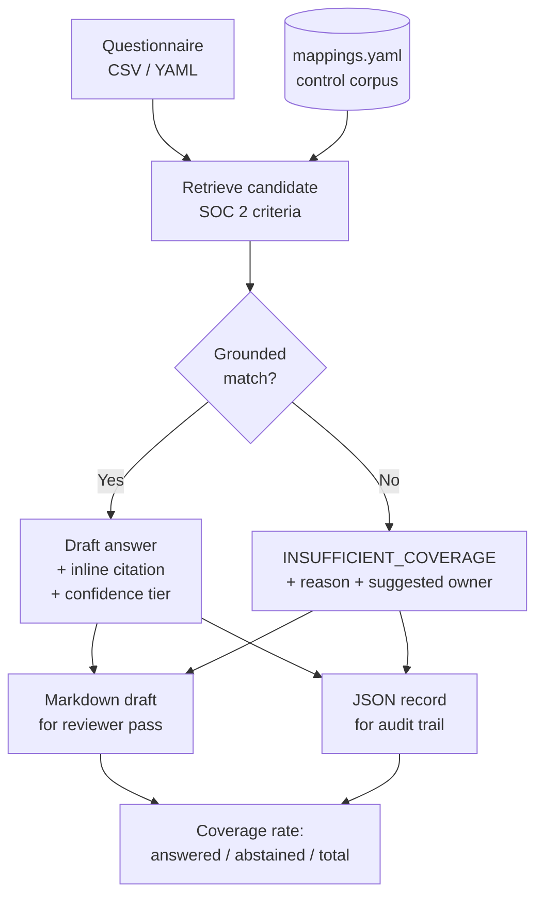

# Security Questionnaire Responder

I draft grounded answers to customer security questionnaires from a version-controlled SOC 2 / ISO 27001 control corpus, and I abstain loudly when I can't. Every drafted answer carries an inline citation to the criterion behind it and a confidence tier inherited from the corpus. Every question the corpus cannot support returns `INSUFFICIENT_COVERAGE` with a reason and a suggested owner. No plausible guesses.

> **Status:** v1.0. Deterministic retrieval, abstention, and dual Markdown/JSON output. The LLM drafting stage is not implemented in v1.0; `prompts/drafting-prompt.md` is the reviewable artifact for when it lands.

## Why This Exists

Security questionnaires bottleneck deals. The usual fix is a copy-paste answer library that silently drifts from the controls it claims. An answer written against a control that has since changed, reused for a year, in front of a customer.

This drafts from a version-controlled crosswalk instead. Each answer cites the criterion it came from, so a reviewer can check the claim against the control rather than trusting the library. When the corpus does not cover a question, the tool says so in the output instead of generating something that reads correct.

That last part is the design center. In an assurance context, a fabricated-but-plausible SOC 2 answer is worse than no answer: it puts an unsupported claim in front of a customer and nobody downstream can tell it apart from a grounded one. Abstention is not the tool failing. It is the tool routing work to a human with a stated reason.

## How It Works



Questions come in as CSV or YAML. Each is matched against the control corpus. A grounded match produces a draft answer citing the source criterion and inheriting that row's confidence label. The tool never computes its own confidence. No grounded match produces an explicit abstention with the reason and a routing suggestion. Both paths land in both outputs, and the run reports a coverage rate.

The corpus is `mappings.yaml` from [SOC 2 / ISO 27001 / NIST 800-53 Rev 5 Crosswalk](https://github.com/0xBahalaNa/soc2-iso27001-nist-crosswalk). Nine mapping rows across 7 SOC 2 criteria, each already carrying a Strong / Partial / Contextual confidence label and a written rationale for the mapping.

## Coverage and Abstention

**This corpus covers 7 SOC 2 Common Criteria.** A real CAIQ or SIG Lite runs to hundreds of questions across domains this corpus does not touch: business continuity, physical security, data residency, subprocessor management, and more.

That boundary is stated rather than hidden. Questions outside corpus scope return `INSUFFICIENT_COVERAGE` with the reason and a suggested owner. Coverage rate is reported on every run, so the honest number (not an inflated one) is what a reviewer sees.

Widening coverage is a corpus problem, not a tool problem. The fix is adding well-reasoned mappings upstream in the crosswalk repo, never loosening the matcher to make the number look better.

**Groundedness (documented decision):** a row must clear both `GROUNDING_THRESHOLD = 2` (raw token overlap) and `MIN_SECURITY_TOKENS = 2` (security-vocabulary overlap) in `retrieve()`, and the top hit must beat the best other-criterion runner-up by `MARGIN = 2.0` in `build_record()`. Two overlapping tokens that are not security-bearing are not enough; a near-tie between two criteria abstains so a human adjudicates. These values are demo-tuned for a mix of answers and abstentions on the sample questionnaire. They are not CLI-tunable.

**Known limit:** deterministic token overlap will sometimes draft an answered record for ordinary non-security English that happens to share corpus vocabulary (e.g. “least privilege … privileged access” on a vending machine → CC6.3). Thresholds and margin cannot reject those without also rejecting real access-control questions, and a growing deny-list of weak tokens does not bound the problem. Treat every answered draft as reviewer-mandatory; widening precision is corpus and retrieval-design work, not a looser matcher.

## Controls Addressed

The corpus pivots on SOC 2 Common Criteria and cross-references ISO 27001:2022 Annex A. NIST 800-53 Rev 5 is present in the corpus as the bridge column between them.

| SOC 2 TSC | ISO 27001:2022 Annex A | Corpus confidence | How this repo uses it |
|---|---|:---:|---|
| CC6.1 | A.5.15, A.8.3 | Strong | Retrieval key + citation target for logical access architecture questions |
| CC6.2 | A.5.16, A.5.18 | Strong | Grounds provisioning / user registration answers |
| CC6.3 | A.8.2, A.8.3 | Strong | Grounds least privilege, RBAC, and access-removal answers |
| CC6.6 | A.8.5, A.5.16 | Strong | Grounds authentication strength answers |
| CC6.6 | A.5.17 | Partial | Authenticator lifecycle, flagged Partial, surfaces to reviewer |
| CC7.2 | A.8.15 | Strong | Grounds logging and event-selection answers |
| CC7.3 | A.8.16 | Strong | Grounds log review / event evaluation answers |
| CC8.1 | A.8.9 | Partial | Baseline configuration, flagged Partial, surfaces to reviewer |
| CC8.1 | A.8.9 | Contextual | Hardened settings, flagged Contextual, weakest grounding, always surfaces |

Partial and Contextual rows are not filtered out. They are drafted with the tier attached so the human reviewer knows exactly which answers need the most scrutiny before the questionnaire goes back to the customer.

## How a Reviewer Uses This Output

The Markdown draft is the human pass. It arrives ordered by question with the drafted answer, the cited criterion, that criterion's mapping rationale, and the confidence tier inline. A reviewer validating a claim reads the control reasoning next to the answer instead of opening a separate crosswalk. Abstentions appear in the same document with their reason and suggested owner, which makes the reviewer's queue explicit rather than something to reconstruct from what's missing.

The JSON record is the audit trail. Each entry captures question, answer (verbatim corpus rationale on answered rows; `null` on abstentions), cited controls (SOC 2 criterion plus ISO 27001:2022 and NIST 800-53 bridge IDs), confidence tier, and abstention reason where applicable. An auditor or a customer's security team can trace any answer back to the criterion it was grounded in. The organization can diff this quarter's responses against last quarter's to see where control claims changed.

## Continuous Assurance Alignment

- Control claims live in a version-controlled corpus, not a spreadsheet or a wiki page. Changes are diffable and reviewable.
- The JSON record is structured output. A trust center, GRC platform, or downstream reporting pipeline can consume it without transcription.
- The tool drafts and routes; it does not send. Abstention is a first-class output path, not an error case.
- Every answer resolves to a corpus row, so no claim in a returned questionnaire is unattributable.
- Coverage rate is reported per run, which turns "how much of this questionnaire can we answer from what we've already documented" into a number instead of a guess.

## Sample Evidence Output

Committed under `samples/responses.md` and `samples/responses.json`, regenerated from
`python respond.py --questionnaire samples/caiq_lite_excerpt.yaml` (same bytes as a fresh
`drafts/` run). Live output also lands in gitignored `drafts/`. Real run: **2/6 (33%)**.

Markdown draft, one answered question and one abstention:

```markdown
### Q1

Describe how you enforce logical access controls for production systems.

**Status:** answered

**Criterion:** SOC 2 CC6.1

**Cross-references:** ISO 27001:2022 A.5.15, A.8.3; NIST 800-53 AC-3

**Confidence:** Strong

**Rationale:** AC-3 enforces approved authorizations for logical access at the system
and application layer. CC6.1 frames logical-access security architecture
and enforcement mechanisms. ISO A.5.15 (access control) and A.8.3
(information access restriction) address the same enforcement intent from
policy and technical restriction angles.

**Source:** corpus/mappings.yaml version 1.0

---

### Q5

What is your data residency commitment for EU customers?

**Status:** INSUFFICIENT_COVERAGE

**Reason:** no grounded corpus match

**Suggested owner:** Privacy / Legal
```

JSON audit record (abstention entry):

```json
{
  "answer": null,
  "confidence": "",
  "criterion": "",
  "iso_27001_2022": "",
  "nist_800_53": "",
  "owner": "Privacy / Legal",
  "question_id": "Q5",
  "question_text": "What is your data residency commitment for EU customers?",
  "rationale": "",
  "reason": "no grounded corpus match",
  "status": "INSUFFICIENT_COVERAGE"
}
```

Run summary:

```
coverage: 2/6 (33%)
answered: 2 | abstained: 4 | total: 6
tiers: Strong 2 | Partial 0 | Contextual 0
```

## Requirements

- Python 3.11+
- [`pyyaml`](https://pyyaml.org/wiki/PyYAMLDocumentation) for corpus and questionnaire parsing (`requirements.txt`)
- Test extras (`requirements-dev.txt`): [`hypothesis`](https://hypothesis.readthedocs.io/), [`pytest`](https://docs.pytest.org/)
- No API key required. The LLM drafting stage is not implemented in v1.0 (`prompts/drafting-prompt.md` holds the versioned prompt); the deterministic retrieval path runs standalone.

```bash
python3 -m venv .venv
source .venv/bin/activate   # Windows: .venv\Scripts\activate
pip install -r requirements.txt
```

## Usage

```bash
python respond.py --questionnaire samples/caiq_lite_excerpt.yaml
```

Loads the vendored corpus, drafts a grounded answer (or abstains) per question, writes `drafts/responses.md` and `drafts/responses.json`, and prints a coverage line. Optional: `--corpus path/to/mappings.yaml` points at another **trusted** pin (not customer YAML); `--out-dir DIR` changes the output directory (default: `drafts/`).

**Exit codes**

| Code | Meaning | Reached by |
|---|---|---|
| `0` | The run completed. Includes a 0% coverage run. A broken pipe (`\| head`) is a normal exit. | Finished run; reader closed the pipe |
| `1` | The run did not complete. Stderr carries an `error: <what>` line (operator-fixable) or `internal error: <Type>: <what>` (tool defect). Parse warnings can precede it. Ctrl-C is this case. | Bad input or IO; interrupt; tool defect |
| `2` | The command line was wrong. Stderr is argparse usage plus one sanitized `error:` line. | argparse |

```bash
pip install -r requirements-dev.txt
python -m unittest test_respond
# or: python -m pytest test_respond.py
```

## Questionnaire schema

Customer questionnaires must match this schema exactly. Anything else is rejected with a clear error. Same abstention-over-fabrication instinct, applied at parse time.

### YAML

```yaml
questions:
  - id: Q1          # optional string (quote values YAML would retype)
    text: "..."     # required string; blank text is kept and flagged
  - id: Q2
    text: "..."
```

Rules:

- Root mapping with exact key `questions` only (no `items`, no aliases, no extra root keys)
- Non-empty list; items are **all** bare strings or **all** mappings, not mixed
- Mapping keys are only `id` and `text`
- YAML merge keys (`<<`) are rejected
- Missing `id` → synthesized `_auto_N` (N = 1-based list position) and flagged; blank `text` → flagged; duplicate ids → flagged

### CSV

```csv
id,text
CAIQ-AIS-01,Describe logical access controls.
CAIQ-AIS-02,How do you provision new users?
```

Rules:

- Headers are exactly `id` and/or `text` (`text` required). No other columns.
- UTF-8 with optional BOM (Excel)
- Rectangular rows; blank or duplicate headers error; row numbers are 1-indexed including the header line
- Missing `id` → synthesized `_auto_N` where **N is the CSV line number** (header is line 1), then flagged, so `_auto_2` is the first data row. This deliberately differs from YAML list-position numbering: CSV ids point operators at the file line they must edit. These ids become the join key in the JSON audit record.

## Repository Structure

```
security-questionnaire-responder/
├── corpus/                     # Vendored mappings.yaml pin (read-only; provenance in header)
├── respond.py                  # CLI: retrieve, draft/abstain, dual Markdown/JSON output
├── test_respond.py             # Schema + property-based input-layer tests
├── samples/                    # Example questionnaire + committed CLI sample output
├── prompts/                    # Versioned optional-LLM drafting prompt (not invoked in v1.0)
├── drafts/                     # Run output (gitignored; regenerated each CLI run)
├── requirements.txt
├── LICENSE.txt
└── README.md
```

## Design Decisions

- Abstention over fabrication. No grounded match returns an explicit abstention, never a low-confidence guess. Unparseable questionnaires are rejected the same way, not silently reshaped.
- Split loaders. The corpus is a trusted citation source; the questionnaire is customer input. Separate loader classes keep the two trust models free to diverge without affecting each other.
- Offline-first. The tool runs and produces meaningful output with no API key, because a reviewer cloning this repo will not have one. The LLM drafting stage is not implemented in v1.0; the versioned prompt under `prompts/` is the reviewable artifact, not a live dependency.
- Confidence is inherited, never computed. Tiers come from the corpus row. The drafting stage cannot upgrade its own confidence.
- Citations must resolve. An answer references a corpus row or it does not ship as an answer.
- The corpus is read-only here. Widening coverage happens upstream in the crosswalk repo, where mappings get written reasoning and a confidence label.

## Future Enhancements

- Embedding-based retrieval as a second matcher, with the deterministic path kept as the fallback and the diff between them reported
- Corpus expansion beyond CC6–CC8 (availability, confidentiality, processing integrity criteria)
- CAIQ v4 and SIG Lite question-format adapters
- Answer-drift detection: diff a questionnaire's answers against a prior run to surface changed control claims

## References

- [SOC 2 / ISO 27001 / NIST 800-53 Rev 5 Crosswalk](https://github.com/0xBahalaNa/soc2-iso27001-nist-crosswalk), the control corpus this tool grounds against
- [Vendor Security Due Diligence](https://github.com/0xBahalaNa/vendor-security-due-diligence), the assessor side of the same trust transaction
- [AICPA Trust Services Criteria](https://www.aicpa-cima.com/resources/download/2017-trust-services-criteria-with-revised-points-of-focus-2022)
- [ISO/IEC 27001:2022](https://www.iso.org/standard/27001)
- [CSA Consensus Assessments Initiative Questionnaire (CAIQ)](https://cloudsecurityalliance.org/research/cloud-controls-matrix)

## License

MIT
