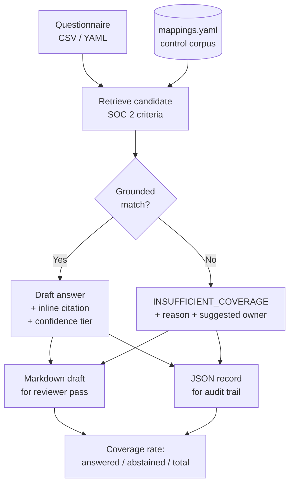

# Security Questionnaire Responder

Drafts grounded answers to customer security questionnaires from a version-controlled SOC 2 / ISO 27001 control corpus — and abstains, loudly, when it can't. Every drafted answer carries an inline citation to the criterion behind it and a confidence tier inherited from the corpus. Every question the corpus cannot support returns `INSUFFICIENT_COVERAGE` with a reason and a suggested owner, never a plausible guess.

> **Status:** v1.0 in development. Scope is the deterministic retrieval path, the abstention path, and dual Markdown/JSON output. The LLM drafting stage is a flag-gated enhancement, not a dependency.

## Why This Exists

Security questionnaires bottleneck deals. The usual fix is a copy-paste answer library that silently drifts from the controls it claims — an answer written against a control that has since changed, reused for a year, in front of a customer.

This drafts from a version-controlled crosswalk instead. Each answer cites the criterion it came from, so a reviewer can check the claim against the control rather than trusting the library. And when the corpus does not cover a question, the tool says so in the output instead of generating something that reads correct.

That last part is the design center. In an assurance context, a fabricated-but-plausible SOC 2 answer is worse than no answer: it puts an unsupported claim in front of a customer and nobody downstream can tell it apart from a grounded one. Abstention is not the tool failing — it is the tool routing work to a human with a stated reason.

## How It Works



Questions come in as CSV or YAML. Each is matched against the control corpus. A grounded match produces a draft answer citing the source criterion and inheriting that row's confidence label — the tool never computes its own confidence. No grounded match produces an explicit abstention with the reason and a routing suggestion. Both paths land in both outputs, and the run reports a coverage rate.

The corpus is `mappings.yaml` from [SOC 2 / ISO 27001 / NIST 800-53 Rev 5 Crosswalk](https://github.com/0xBahalaNa/soc2-iso27001-nist-crosswalk) — 9 mapping rows across 7 SOC 2 criteria, each already carrying a Strong / Partial / Contextual confidence label and a written rationale for the mapping.

## Coverage and Abstention

**This corpus covers 7 SOC 2 Common Criteria.** A real CAIQ or SIG Lite runs to hundreds of questions across domains this corpus does not touch — business continuity, physical security, data residency, subprocessor management, and more.

That boundary is stated rather than hidden. Questions outside corpus scope return `INSUFFICIENT_COVERAGE` with the reason and a suggested owner. Coverage rate is reported on every run, so the honest number — not an inflated one — is what a reviewer sees.

Widening coverage is a corpus problem, not a tool problem. The fix is adding well-reasoned mappings upstream in the crosswalk repo, never loosening the matcher to make the number look better.

## Controls Addressed

The corpus pivots on SOC 2 Common Criteria and cross-references ISO 27001:2022 Annex A. NIST 800-53 Rev 5 is present in the corpus as the bridge column between them.

| SOC 2 TSC | ISO 27001:2022 Annex A | Corpus confidence | How this repo uses it |
|---|---|:---:|---|
| CC6.1 | A.5.15, A.8.3 | Strong | Retrieval key + citation target for logical access architecture questions |
| CC6.2 | A.5.16, A.5.18 | Strong | Grounds provisioning / user registration answers |
| CC6.3 | A.8.2, A.8.3 | Strong | Grounds least privilege, RBAC, and access-removal answers |
| CC6.6 | A.8.5, A.5.16 | Strong | Grounds authentication strength answers |
| CC6.6 | A.5.17 | Partial | Authenticator lifecycle — flagged Partial, surfaces to reviewer |
| CC7.2 | A.8.15 | Strong | Grounds logging and event-selection answers |
| CC7.3 | A.8.16 | Strong | Grounds log review / event evaluation answers |
| CC8.1 | A.8.9 | Partial | Baseline configuration — flagged Partial, surfaces to reviewer |
| CC8.1 | A.8.9 | Contextual | Hardened settings — flagged Contextual, weakest grounding, always surfaces |

Partial and Contextual rows are not filtered out. They are drafted with the tier attached so the human reviewer knows exactly which answers need the most scrutiny before the questionnaire goes back to the customer.

## How a Reviewer Uses This Output

The Markdown draft is the human pass. It arrives ordered by question with the drafted answer, the cited criterion, that criterion's mapping rationale, and the confidence tier inline — so a reviewer validating a claim reads the control reasoning next to the answer instead of opening a separate crosswalk. Abstentions appear in the same document with their reason and suggested owner, which makes the reviewer's queue explicit rather than something to be reconstructed from what's missing.

The JSON record is the audit trail. Each entry captures question, answer, cited controls, confidence tier, and abstention reason where applicable. That structure is what makes a completed questionnaire reviewable after the fact: an auditor or a customer's security team can trace any answer back to the criterion it was grounded in, and the organization can diff this quarter's responses against last quarter's to see where control claims changed.

Together they close the loop that a copy-paste answer library leaves open — retrieve, cite, tier, review, retain.

## Continuous Assurance Alignment

- **Compliance-as-code:** control claims live in a version-controlled corpus, not a spreadsheet or a wiki page. Changes are diffable and reviewable.
- **Machine-readable evidence:** the JSON record is structured output, consumable by a trust center, a GRC platform, or a downstream reporting pipeline without transcription.
- **Human-in-the-loop by design:** the tool drafts and routes; it does not send. Abstention is a first-class output path, not an error case.
- **Traceability:** every answer resolves to a corpus row, so no claim in a returned questionnaire is unattributable.
- **Deal-cycle impact:** coverage rate is reported per run, which turns "how much of this questionnaire can we answer from what we've already documented" into a number instead of a guess.

## Sample Evidence Output

> Target output shape for v1.0. Committed samples land in `samples/` when the implementation ships.

Markdown draft — one answered question and one abstention:

```markdown
### Q4. Describe how you enforce least privilege for administrative access.

**Answer (confidence: Strong)**
Access is granted on a role basis and limited to what each role requires for its
assigned tasks. Role changes trigger modification or removal of the corresponding
access rights.

**Grounded in:** SOC 2 CC6.3 → ISO 27001:2022 A.8.2, A.8.3
**Rationale:** CC6.3 covers role-based access, modification, and removal including
least privilege and segregation of duties. ISO A.8.2 (privileged access rights) and
A.8.3 (information access restriction) align with privilege minimization.

---

### Q5. What is your data residency commitment for EU customers?

**INSUFFICIENT_COVERAGE**
**Reason:** No corpus criterion addresses data residency or geographic processing
restrictions. Corpus scope is SOC 2 CC6-CC8 (access, monitoring, change management).
**Suggested owner:** Legal / Privacy
```

JSON audit record:

```json
{
  "question_id": "Q5",
  "question": "What is your data residency commitment for EU customers?",
  "status": "INSUFFICIENT_COVERAGE",
  "answer": null,
  "cited_controls": [],
  "confidence": null,
  "abstention_reason": "No corpus criterion addresses data residency or geographic processing restrictions.",
  "suggested_owner": "Legal / Privacy"
}
```

Run summary:

```
Coverage: 6 answered / 4 abstained / 10 total  (60.0%)
Confidence breakdown: Strong 4 | Partial 2 | Contextual 0
```

## Requirements

- Python 3.11+
- [`pyyaml`](https://pyyaml.org/wiki/PyYAMLDocumentation) — corpus and questionnaire parsing
- No API key required. The LLM drafting stage is optional and flag-gated; the deterministic retrieval path runs standalone.

## Usage

```bash
python respond.py --questionnaire samples/caiq_lite_excerpt.yaml --out drafts/
```

Runs the deterministic retrieval path and writes both the Markdown draft and the JSON record to `drafts/`. Add `--llm` to enable the drafting-stage enhancement (requires a configured provider); the versioned prompt used for that stage is committed in-repo so it is reviewable as an artifact.

## Repository Structure

```
security-questionnaire-responder/
├── respond.py                  # CLI entrypoint — retrieve, draft, abstain, emit
├── prompts/                    # Versioned LLM prompt (reviewable artifact)
├── samples/                    # Example questionnaire + committed sample output
├── drafts/                     # Run output (gitignored)
├── requirements.txt
├── LICENSE.txt
└── README.md
```

## Design Decisions

- **Abstention over fabrication.** No grounded match returns an explicit abstention, never a low-confidence guess. This is the load-bearing decision of the repo.
- **Offline-first.** The tool runs and produces meaningful output with no API key, because a reviewer cloning this repo will not have one. The LLM stage is an enhancement behind a flag, not a dependency.
- **Confidence is inherited, never computed.** Tiers come from the corpus row. The drafting stage cannot upgrade its own confidence.
- **Citations must resolve.** An answer references a corpus row or it does not ship as an answer.
- **The corpus is read-only here.** Widening coverage happens upstream in the crosswalk repo, where mappings get written reasoning and a confidence label.

## Future Enhancements

- Embedding-based retrieval as a second matcher, with the deterministic path kept as the fallback and the diff between them reported
- Corpus expansion beyond CC6–CC8 (availability, confidentiality, processing integrity criteria)
- CAIQ v4 and SIG Lite question-format adapters
- Answer-drift detection — diff a questionnaire's answers against a prior run to surface changed control claims

## References

- [SOC 2 / ISO 27001 / NIST 800-53 Rev 5 Crosswalk](https://github.com/0xBahalaNa/soc2-iso27001-nist-crosswalk) — the control corpus this tool grounds against
- [Vendor Security Due Diligence](https://github.com/0xBahalaNa/vendor-security-due-diligence) — the assessor side of the same trust transaction
- [AICPA Trust Services Criteria](https://www.aicpa-cima.com/resources/download/2017-trust-services-criteria-with-revised-points-of-focus-2022)
- [ISO/IEC 27001:2022](https://www.iso.org/standard/27001)
- [CSA Consensus Assessments Initiative Questionnaire (CAIQ)](https://cloudsecurityalliance.org/research/cloud-controls-matrix)

## License

MIT
